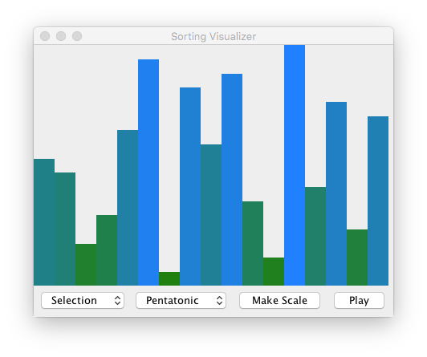

*(This assignment is inspired by the work of [Timo Bingmann](http://panthema.net/2013/sound-of-sorting/) and [Casey Rule](http://www.caseyrule.com/projects/sounds-of-sorting/)!)*

In this assignment, we will build both a *visualizer* and *audibilizer*
for the various sorting algorithms that we have implemented or
We will also utilize the *list implementations* that you have worked
on.

## Part 0: Packages

_You may find that some/all of this section is familiar.  We have retained
it in case you need a refresher._

This is the largest Java program that we have implemented so far as it will require many Java files for all of the classes we will write.
To help manage this complexity, we will utilize Java *packages* which allows us to arrange collections of source files into logical units.
Up to this point, we have been clients of Java packages, but have not actually used them in our code.
For example, we needed to use the `File` class in the past to represent text files that we wanted to access.
To make the File class known to the Java compiler, we either needed to use an import declaration:

```java
import java.io.File;
```

or refer to the `File` class using its *fully-qualified name* which consists of the package name appended onto the class name with a dot:

```java
java.io.File file = null;
```

The package structure of a Java program reflects the directory structure of the Java source files.
Recall that every .java file must contain a public class whose name is the name of the file (without the .java extension).
The fact that the `File` class is in the `java.io` package means that, on disk, the source code for File is in a file called `File.java` in the directory `java/io`.
Note how the dots become the separators for nested directories in the package name.

Luckily, Eclipse hides these details in its project management system, so we do not need to worry about them as long as we do all of our package management within Eclipse.
To create a package in Eclipse, right-click your Project in Package Explorer and choose New > Package.
After you create your package, you can either right-click individual source files and choose Refactor → Move to move them into the package or simply drag-and-drop the source file into the package.
This will add a *package declaration* to your source file, *e.g.*:

```java
package edu.grinnell.sortingvisualizer;
```

Which declares that the source file must exist in the directory denoted by the package name, here `edu/grinnell/sortingvisualizer`.

Note that standard Java naming conventions require us to name packages in a particular way:

> Package names should be written in all lower case (to avoid name clashes with classes and interfaces).
> Package names should begin with the reversed Internet domain of your company, *e.g.*, com.example.mypackage, if you work at example.com and your package name is mypackage.

For this homework, we will assume that our company is `grinnell.edu` and our top-level package is `sortingvisualizer`.
All your source files should exist in subpackages of the `grinnell.edu.sortingvisualizer` package as indicated in the directions below:

* Files related to your sorting algorithms should be placed in the `sorts` subpackage.
* Files related to sorting events should be placed in the `events` subpackage.
* Files related to rendering should be placed in the `rendering` subpackage.
* Files related to audio should be placed in the `audio` subpackage.

The main driver for your program should sit at the root of your package hierarchy, *i.e.*, `grinnell.edu.sortingvisualizer`.

## Part 1: Sorting algorithms

First, we will implement a number of sorting algorithms over *generic array lists* as discussed in class.
The sorting algorithms you need to implement and subsequently instrument in the next part are:

1. Selection Sort
2. Insertion Sort
3. Merge Sort
4. Quick Sort

In addition, you should implement *one additional comparison-based sorting algorithm* beyond the four listed above.
You may choose to implement a sorting algorithm that you find online, *e.g.*, [the Wikipedia article on Sorting Algorithms](https://en.wikipedia.org/wiki/Sorting_algorithm), or come up with on your own.
There are no time or space complexity requirements, but your sort must be processable by the sorting event architecture you develop in the next section.

Your sorts should operate over *generic array lists* and be implemented in a file called `Sorts.java`.
For example, the signature of selection sort would be:

```java
public static <T extends Comparable<T>> void selectionSort(T[] arr) { /* ... */ }
```

In addition to `Sorts.java`, you should also implement a *JUnit test suite* for each sorting function in a file called `SortsTest.java`.
For each sort, you should have a test method that exercises the sort over a reasonably large set of random and not-so-random examples.  (You may want to see the sorting tests from the makeup exam for ideas.)
Make sure to choose diverse examples that explore both the common and corner cases for that particular sort.

## Part 2: Instrumenting our sorting algorithms

In order to visualize and audibilize our sorting algorithms, we must *instrument* our sorting algorithms so that we can see how they mutate the input list at each step.
There are various advanced techniques for doing this, *e.g.*, callbacks or continuations.
However here, we will simply *log* the interesting operations that our sorting algorithms perform and store them in a *list* for playback later.

We'll represent these possible *sorting events* as a collection of classes united by a common interface.
This interface is `SortEvent<T>` which represents a sort event over a generic list of `T`s.
The `SortEvent<T>` interface possesses the following methods:

* `void apply(arr)`: applies this sort event to the given list.
* `List<Integer> getAffectedIndices()`: returns a list containing all of the indices that this event affects.
* `boolean isEmphasized()`: return true if this event should be emphasized by the visualizer/audibilizer.

There are three kinds of events to implement:

* *Compare Events* that are logged whenever an algorithm compares two elements of the list.
  Compare events are not emphasized, and their affected indices are the indices of the elements being compared.
  Applying a compare event does nothing to an list.
* *Swap Events* that logged whenever an algorithm swaps elements of the list.
  Swap events are emphasized, and their affected indices are the indices of the elements being swapped.
  Applying a swap event swaps the recorded indices of the list.
* *Copy Events* that fire whenever an algorithm copies an element into an index of the list.
  Copy events are emphasized, and the affected index is the destination of the copy.
  Applying a copy event performs the copy of the recorded value into the list.

You should implement three classes, `CompareEvent<T>`, `SwapEvent<T>`, and `CopyEvent<T>` that implement the `SortEvent<T>` interface and the behavior described above.
Keep in mind that the generic type parameter will need to be constrained to the `Comparable<T>` interface!

On top of these events, you should implement one final sort in `Sorts.java`:

* `void eventSort(ArrayList<T> l, List<SortEvent<T>> events)`, : given an array list of `T`s and list of `SortEvent<T>` objects, apply those events to the list in-order.

To instrument your sorting algorithms:

1. Implement the `SortEvent<T>` class hierarchy.
2. Augment your sorting algorithms in `Sorts.java` so that they create and return a list of `SortEvent<T>` objects that capture all the events that the given algorithm creates.
3. Implement `eventSort` as described above.
4. Augment your sorting tests in `SortsTest.java` to test that the lists of `SortEvent<T>`s generated by each sorting algorithm capture the behavior of the algorithm.
In particular, your tests should ensure that if an algorithm generates a list `l` of events, then `eventSort(originalArr, l)` should sort the (original) list as long as the algorithm correctly sorted the list to begin with.
It will be useful to create a copy of your list using the [clone()](https://docs.oracle.com/javase/8/docs/api/java/util/ArrayList.html#clone--) method of the `ArrayList` class.

## Part 3: The visualizer and the audibilzer

With the engine of the program completed, you can now integrate it into the `SortingVisualizer` graphical user interface (GUI).
We have provided the core of the GUI code for this program to get you started:

* [SortingVisualizerGUI.zip](../files/SortingVisualizerGUI.zip)

Copy these files into your project.
They should all reside in the `edu.grinnell.sortingvisualizer` package.
Here is a description of each file:

* `SortingVisualizer.java`: the entry point of the program.
* `ArrayPanel.java`: the portion of the GUI that renders the note indices to the screen.
* `ControlPanel.java`: the portion of the GUI that contains widgets to control the program.
* `Scale.java`: an object that encapsulates a musical scale represented by a collection of [MIDI](https://en.wikipedia.org/wiki/MIDI) notes.
* `NoteIndices.java`: an object that encapsulates a collection of indices into a particular Scale object.

Most importantly, `Scale` and `NoteIndices` connects your engine to the GUI.
Rather than sorting the notes of a `Scale` directly, you will instead sort an array of indices into this `Scale` (as retrieved by the `getNotes` method of the `NoteIndicies` class).
This is so that the you can render each note uniformly in the `ArrayPanel` class.
For example, then notes of the B minor pentatonic scale are given by the following MIDI note values:

```{.java}
// In ControlPanel.java...
public static final int[] bMinorPentatonicValues =
    new int[] { 46, 49, 51, 53, 56, 58, 61, 63, 65, 68, 70, 73, 75, 78, 82, 85, 87 };
```

A `NoteIndices` object that contains indices into this scale may possess an array as follows:

```java
[6, 1, 10, 12, 2, 8, 16, 5, 13, 7, 9, 0, 11, 14, 3, 15, 4]
```

Here, the values of the array correspond to indices into the scale.
For example, at index 5 of this array is the index 8 which corresponds to the MIDI value 65 (*i.e.*, index 8 of `bMinorPentatonicValues`).

The renderer, `ArrayPanel`, renders each of the indices as a bar whose height corresponds to the index.
For example, here is an example of rendering a particular array of indices:



This image corresponds to the following indices array:

```java
[8, 7, 2, 4, 10, 15, 0, 13, 9, 14, 5, 1, 16, 6, 12, 3, 11]
```

Note that the 7th bar is the smallest because it corresponds to index 6 which contains 0.
In contrast, the 13th bar (index 11) is the largest because it contains 16---the largest value in the array.
The largest bar extends to the top of the panel whereas the smallest bar is the smallest sliver.

To render a particular sort, we first generate a list of sorting events on a copy of the indices array.
Then, we replay the sort, event-by-event on the original array.
On every event, we play MIDI notes (using our `Scale` object) corresponding to the affected indices of the sorting event.

To complete the program, you should:

1. Implement the stubbed methods in `NoteIndices.java`
2. Complete the stubbed method in `ArrayPanel.java`.
   Use the methods of the [Graphics](https://docs.oracle.com/javase/8/docs/api/java/awt/Graphics.html) object to render each element of the indices array in the panel's `NoteIndices` object.
3. Implement the stubbed methods in `ControlPanel.java` to tie it all together.
